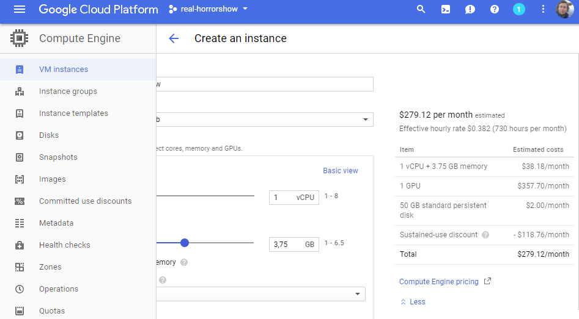
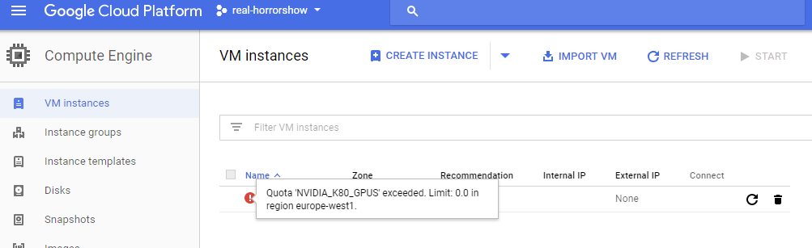

# Setup a VM in Google Compute Engine for Machine Learning on Google Cloud Platform

Following a tutorial and trying to keep a log that's just one step away from a deployment script (hopefully).

I never used google compute engine, nor is Python and its libraries one where I'm strong in. So, we'll see how it goes.

## Technologies

I guess:

* setup vm
* secure vm / firewall
* post install steps
* GCE uses TFU Chips which go zooooooooom, as i heard
* Tensorflow
* Jupyternotebook
* All the Python stuff around jupyternotebook
* Docker / Kubernetes orchestration stuff (I assume all the parts to run in docker, but I have no idea, if, ... like, does a deliverable object fall out of a jupyter notebook, such that there might be some continuous delivery chain somehow integrating a jupyter notebook? well, you see, I got limited experience here. Let's change that.)

### Source

***[https://medium.com/google-cloud/jupyter-tensorflow-nvidia-gpu-docker-google-compute-engine-4a146f085f17]***

Just commenting down as I go along

#### Firewall rules

Ok, before creating any machines, have IPs or stuff even touched, starting off creating two firewall rule objects (one for each port).
Those objects have tags, I guess that's how it works then, I assign tags and groups of 'objects' which can represent all kinds of stuff,
which are then available wherever I need just by entering it's name. Let's see, the two ports are:

| *port* | *tag or name* | *IPs*                |*allow?*|*priority*|*other* |
|:-------- |:----------- |:-------------------- |:-----:| --------:| ------- |
| tcp:8888 | jupyter     | IP ranges 0.0.0.0/0  | allow | 1000     | default |
| tcp:6006 | tensorboard | IP ranges 0.0.0.0/0  | allow | 1000     | default |

##### Result

###### jupyter tcp:8888

Before saving my settings i find two great options next to the __CREATE__ Button:

* Show as REST request
  * `./code_snippets/001_real-horrorshow.firewalls.jupyter.post.rest` 
  * so there is a Google REST API [https://cloud.google.com/compute/docs/reference/latest/?hl=en_GB] that let's me do these setups without the web ui
* Show as command line
  * `./code_snippets/001_real-horrorshow.firewalls.jupyter.gcloud`
  * GCloud Command Lind [https://cloud.google.com/sdk/gcloud/reference/compute/?hl=en_GB] comes with its own gcloud shell which I don't know anything about yet.

For everyone familiar with auto - deployment on Websphere with jython, kind of like that. So from here onwards I mostly just link to files containing the settings in those formats.

###### tensorboard tcp:6006

* REST Request
  * `./build_scripts/01b_real-horrorshow.firewalls.tensorboard.post.rest`
* GCloud Command
  * `./build_scripts/01b_real-horrorshow.firewalls.tensorboard.gcloud`
  
##### Creating the VM (dang expensive, yo! one of those K80s, jeez)

I gave the machine the name *gce-horrorshow*

and I didn't expect the price calculation for under 4 Gigs of RAM, a single core, plus 1GPU per months:

* REST `./build_scripts/02a_gce-horrorshow.machine.post.rest`
* GCloud `./build_scripts/02a_gce-horrorshow.machine.gcloud`

As before I copied the rest and cmd output for possible fututure reuse, who knows and clicked create, but now I find out, that the freshly create VM already seems to be blocked because of not enough resources, or how it interpret this warning:

Gonna see how it looks like tmr.
